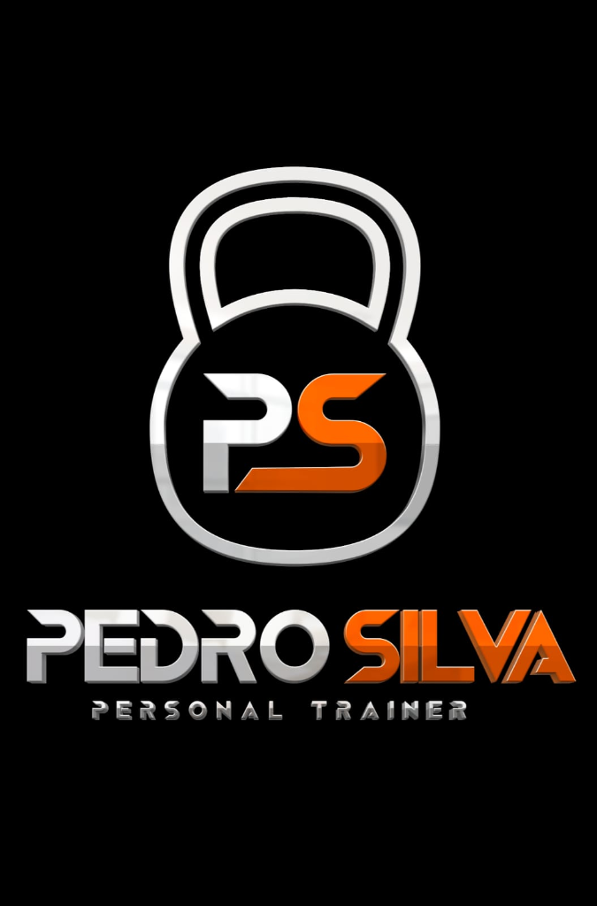

<h1 align="center">
  
  <br>
  Pedro Silva Personal Trainer
</h1>

<p align="center">
  
  
  
  
</p>

<p align="center">
  <strong>Landing Page de alta conversão para suporte a consultoria online e presencial.</strong>
</p>

---

## ✨ Features
- **Conversão Direta:** Integração fluida com WhatsApp para fechamento de vendas imediata.
- **Experiência Interativa:** Comparativo Antes/Depois interativo para demonstração de resultados.
- **Interface Premium:** Design dark mode sofisticado com animações suaves influenciadas pela biomecânica.
- **Mobile First:** Totalmente responsivo para garantir acessos em qualquer dispositivo.

## 🚀 Demo
🔗 [Acesse o site em produção aqui](https://pedrosilvapersonal.netlify.app/)


## 🛠️ Stack
| Camada | Tecnologia |
|--------|------------|
| Core | React 19 + Vite |
| Estilização | Tailwind CSS |
| Animações | Framer Motion |
| Ícones | Lucide React |

## ⚡ Instalação rápida
```bash
git clone https://github.com/thiago536/PedroPersonal
cd PedroPersonal
npm install
npm run dev
```

## 📝 Licença
Este projeto está sob a licença MIT.
